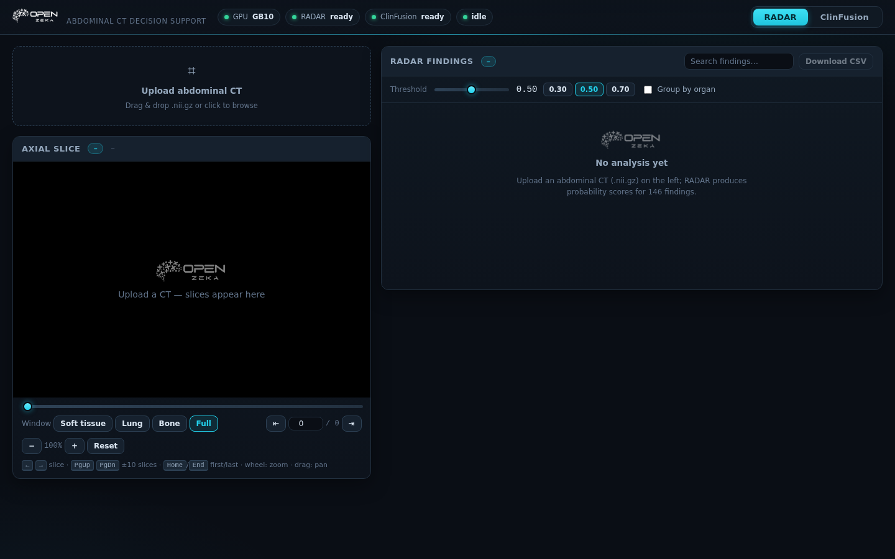
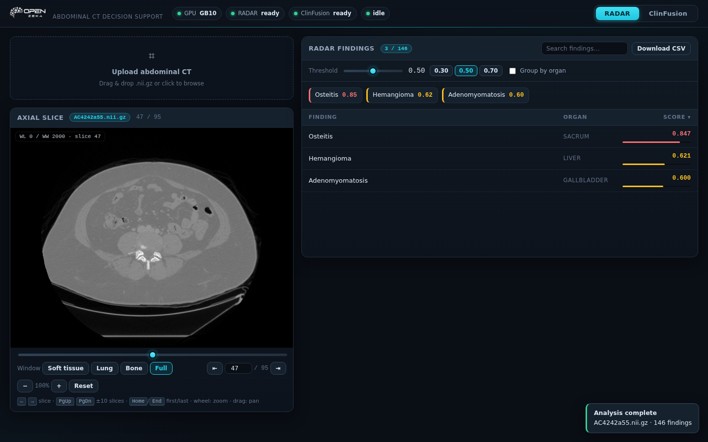

# MedPortal — User Guide

A walkthrough for the web UI at `http://<your-dgx-spark>:8080`, which combines two
medical imaging models behind a single portal: **RADAR** for abdominal CT finding
detection, and **ClinFusion-32B** for conversational medical image analysis.

If you are looking for engineering/architecture detail instead, see [`radar.md`](radar.md)
and [`clinfusion.md`](clinfusion.md) next to this file.

---

## 1. Getting to the portal

Open `http://<your-dgx-spark-address>:8080` in a browser once `./run.sh` reports the
worker is ready (this takes about 14 minutes the first time on a fresh machine, while
the 32B model loads into memory).

You land on the **RADAR** tab. The **ClinFusion** tab is one click away at the top
right.

---

## 2. RADAR tab — abdominal CT finding detection

The screen has three areas: a **drop zone** (top-left), a **slice viewer** (left), and
the **findings panel** (right).

### Uploading a scan

Drop a `.nii.gz` (or `.nii`) file onto "Upload abdominal CT", or click to browse.
RADAR expects **contrast-enhanced abdominal CT** — axial slices, HU-valued. Inputs
outside this distribution (non-contrast, chest CT, etc.) produce unreliable scores.

While analysis runs you will see a loading indicator; when done, the findings table
populates and a small toast confirms completion.

### Reading the findings table

Each row is one of the **146 findings** RADAR scores:

| Column | Meaning |
|---|---|
| **Finding** | The finding name (organ prefix stripped for readability, e.g. `Liver_Cirrhosis` → `Cirrhosis`) |
| **Organ** | Which organ the finding relates to |
| **Score** | A `0–1` probability-like score (see note below) |

A highlight bar under each score helps you scan the column visually.

**How to interpret the score:** treat it as the model's own confidence that this
finding is present in this study — **not** as a calibrated diagnosis probability. A
score of `0.71` on `Liver_Cirrhosis` does not mean "71% chance this patient has
cirrhosis." Rankings matter more than absolute values in day-to-day triage, and a low
score does not rule a finding out — it just means the model did not find enough imaging
evidence here to raise it. Always confirm against your own read and the clinical
context.

### Controlling what you see

- **Threshold slider** (0.30 / 0.50 / 0.70 presets) — show only findings at or above a
  given score. Lower = more findings (and more noise); higher = a shorter, more
  confident list.
- **Search box** — filter the table by finding name.
- **Group by organ** — collapse rows by organ, highest-scoring group first.
- **Top chips** — the six highest scoring findings above the table, for a quick glance.
- **Download CSV** — export scores for the whole study (not just the visible slice).

### Navigating the scan

The slice viewer is an axial slice browser with windowing controls:

- **Window presets:** `Soft tissue`, `Lung`, `Bone`, `Full` (WC/WW mass-settings if you
  prefer windowing manually).
- **Keyboard:** `←`/`→` step one slice, `PgUp`/`PgDn` step ten, `Home`/`End` jump to
  first/last slice.
- **Mouse:** scroll to zoom, drag to pan when zoomed.

---

## 3. ClinFusion tab — conversational medical image analysis

Switch to the **ClinFusion** tab to ask free-text questions about images and volumes.

### What you can attach

| Type | Formats | Notes |
|---|---|---|
| 2D images | `.jpg`, `.jpeg`, `.png` | Screenshots, X-rays, pathology slides, etc. |
| 3D volumes | `.nii.gz`, `.nii` | CT/MRI — ClinFusion reasons over a representative set of slices plus volumetric information |

Attach with the `📎` button; a preview appears in the right-hand **Attachments**
panel. Attachments stay in the panel across turns and get ticked `✓ sent` after use.

### Asking questions

Type a question and press `Enter` (`Shift+Enter` for a newline). ClinFusion keeps
conversation context across turns — you can follow up naturally ("what about the liver
finding?") without restating everything.

**Tips that get better answers:**

- **Be specific about what you want back.** "Give me a 20-item checklist for evaluating
  hepatic masses on CT" works better than "tell me about liver masses."
- **Chunk follow-ups.** Long multi-part answers benefit from being asked for in
  sections rather than all at once.
- **For a small region of interest**, consider cropping that region into a 2D image and
  attaching it rather than uploading an entire 3D series and hoping the sampled slices
  happen to cover it.

### Limits to know about

- **Generative, not deterministic.** ClinFusion is a language model — hallucinated
  findings are a real failure mode. Verify any specific measurement or finding in the
  source imaging before acting on it.
- **Long answers are hard-capped** at 16.384 tokens. If an answer hits this ceiling, a
  visible truncation note is appended rather than silently cutting off: ask a follow-up
  question to continue ("Go on", "Give me section 2").
- **A slow first answer is normal.** Each generation depends on a resident 32B model —
  expect delays of seconds to minutes depending on complexity.

---

## 4. Common workflows

- **Quick second-read on an abdominal CT.** Drop the `.nii.gz` in RADAR, read the top
  chips, then use the threshold slider to widen or narrow the candidate list before
  forming your own conclusion.
- **Case-based discussion.** Bring up RADAR findings first, then switch to ClinFusion
  with the same CT (or a cropped region) attached to discuss what you are seeing, ask
  for a differential, or draft a structured report section you can then verify and edit.

---

## 5. Troubleshooting

| Symptom | What to check |
|---|---|
| RADAR fails with an OOM / out-of-memory error shortly after a ClinFusion turn | Unified-memory contention between the resident 32B model and RADAR's own model load; retry after page cache has settled (or free the cache: `echo 3 > /proc/sys/vm/drop_caches` requires privileges) |
| `ClinFusion: no server` / `backend kapalı` | `./run.sh` did not finish; it waits for the 32B model (~14 min) before starting the backend |
| An analysis produces 0 findings shown | The default threshold (0.50) may simply be hiding lower-scoring findings — slide the threshold down to 0.30 and see if more appear |
| Nothing appears in the Attachments panel after clicking `📎` | The upload failed; the toast in the bottom-right will say why (check file size limit — 500 MB — and file type) |